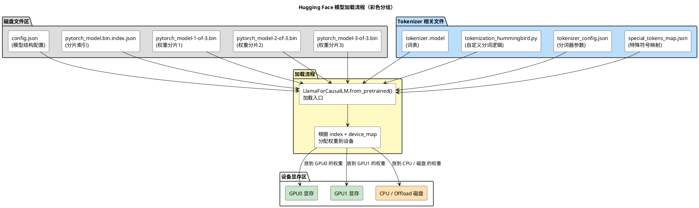

[toc]

# AI 记录\_1

## Hugging Face 介绍

Hugging Face（简称 HF）是一家人工智能公司，同时也是一个开源社区和工具生态的统称，主要聚焦于 **自然语言处理（NLP）**、**计算机视觉（CV）**、**音频处理** 等机器学习领域。它有几个核心特点：

**一、公司和社区**

- **公司背景**
  成立于 2016 年，最初是一款聊天机器人公司，但后来转型做机器学习平台。
- **社区生态**
  Hugging Face 维护着一个非常活跃的开源社区，任何人都可以上传、分享和下载模型、数据集。

**二、核心产品与工具**

| 模块 / 工具          | 作用                                                                                                          |
| -------------------- | ------------------------------------------------------------------------------------------------------------- |
| **Transformers**     | 最知名的 Python 库之一，支持数千个预训练模型（BERT、GPT、LLaMA、Stable Diffusion 等），方便加载、推理和微调。 |
| **Datasets**         | 高效加载和处理大规模数据集，支持流式读取、分布式加载。                                                        |
| **Tokenizers**       | 超快的分词工具（用 Rust 编写），支持 BPE、WordPiece、SentencePiece 等算法。                                   |
| **Accelerate**       | 分布式训练/推理的统一接口，屏蔽多 GPU / TPU / CPU 的底层复杂性。                                              |
| **Hugging Face Hub** | 模型、数据集、空间应用的集中托管平台（类似 GitHub，但专门为 AI 资源设计）。                                   |
| **Spaces**           | 可以在浏览器里部署 ML/DL Web 应用（基于 Gradio/Streamlit），方便在线演示模型效果。                            |

**三、Hugging Face Hub**

- 就像 GitHub 一样，每个模型、数据集、应用都有一个仓库。

- 通过 `from_pretrained()` 就可以直接从 Hub 拉取模型。调用后，HF 会按固定顺序去加载 **配置文件 → 分词器 → 权重文件 → 组装模型**，并且支持分片（shard）和设备映射（device_map）。

- 例如：

  ```python
  from transformers import AutoModelForCausalLM, AutoTokenizer

  model = AutoModelForCausalLM.from_pretrained("meta-llama/Llama-2-7b-hf")
  tokenizer = AutoTokenizer.from_pretrained("meta-llama/Llama-2-7b-hf")
  ```

**四、为什么它很流行**

- **统一接口**：无论是 GPT、BERT、LLaMA、Stable Diffusion，都能用类似的 API 调用。
- **社区驱动**：模型更新快、数量多（目前 Hub 上有 1M+ 模型）。
- **开源 & 免费**：核心库完全开源，便于研究和商用落地。
- **强大的生态链**：从数据集准备 → 模型训练 → 推理部署 → 应用演示，一站式打通。

## Hugging Face 格式模型目录

下面的文件基本就是 Hugging Face 格式的完整模型目录：

```log
model_folder
├── config.json
├── pytorch_model-1-of-3.bin
├── pytorch_model-2-of-3.bin
├── pytorch_model-3-of-3.bin
├── pytorch_model.bin.index.json
├── special_tokens_map.json
├── tokenization_hummingbird.py
├── tokenizer_config.json
└── tokenizer.model
```

它们的作用和加载时的角色如下：

**一、`config.json`**

- **作用**：模型结构与超参数的定义文件，JSON 格式。
- **内容**：包括模型类型、层数（`num_hidden_layers`）、隐藏维度（`hidden_size`）、注意力头数、词表大小（`vocab_size`）、激活函数类型、位置编码等信息。
- **加载时机**：`LlamaForCausalLM.from_pretrained(...)` 会先读取这个文件，构建模型结构的空壳（参数还未加载）。
- **注意**：如果你改了这个文件的配置（例如 vocab_size），必须与权重匹配，否则加载会报错。

**二、 `pytorch_model-1-of-3.bin`, `pytorch_model-2-of-3.bin`, `pytorch_model-3-of-3.bin`**

- **作用**：模型参数的权重文件，按分片（shard）存储。
- **原因**：大模型权重大于单个文件系统或 Git LFS 的限制（2GB 左右）时，Hugging Face 会自动拆成多片。
- **内容**：每个 `.bin` 文件包含一部分 `state_dict`（tensor 权重），文件名中 `x-of-y` 表示这是 y 片中的第 x 片。
- **加载时机**：`from_pretrained` 根据索引文件 `pytorch_model.bin.index.json` 找到对应权重所在分片并加载到内存/显存。

**三、 `pytorch_model.bin.index.json`**

- **作用**：权重索引文件，告诉加载器每个权重（tensor 名称）在哪个分片 `.bin` 文件里。

- **示例结构**：

  ```json
  {
    "metadata": { "total_size": 1234567890 },
    "weight_map": {
      "model.embed_tokens.weight": "pytorch_model-1-of-3.bin",
      "model.layers.0.self_attn.q_proj.weight": "pytorch_model-2-of-3.bin",
      ...
    }
  }
  ```

- **意义**：让加载过程可以**只加载需要的分片**（尤其在 `device_map` 分布式加载时，大幅节省内存）。

**四、 `special_tokens_map.json`**

- **作用**：定义模型使用的特殊 token 对应关系。

- **常见字段**：

  ```json
  {
    "bos_token": "<s>",
    "eos_token": "</s>",
    "unk_token": "<unk>",
    "pad_token": "<pad>"
  }
  ```

- **加载时机**：`AutoTokenizer.from_pretrained` 会读取这个文件，把特殊 token 映射到词表 ID，并用于编码/解码时自动插入/去除这些 token。

**五、 `tokenization_hummingbird.py`**

- **作用**：自定义 tokenizer Python 代码文件。
- **场景**：如果 tokenizer 逻辑不是 Hugging Face 内置的（如 BPE、SentencePiece 等），而是定制版本，Hugging Face 允许在模型目录中放一个 `.py` 文件，实现一个类（继承 `PreTrainedTokenizer` 或 `PreTrainedTokenizerFast`）。
- **加载方式**：需要 `trust_remote_code=True` 才会执行这个文件的代码来创建 tokenizer。否则会因安全策略拒绝加载。
- **提示**：安全性要注意，这个文件是可执行 Python 代码。

**六、 `tokenizer_config.json`**

- **作用**：tokenizer 的配置文件，JSON 格式。
- **内容**：包含分词算法类型、大小写处理、是否添加特殊符号、模型文件名（如 `tokenizer.model`）、截断/填充规则等。
- **加载时机**：`AutoTokenizer.from_pretrained` 会读取它，然后结合 `special_tokens_map.json` 初始化 tokenizer 对象。

**七、 `tokenizer.model`**

- **作用**：分词模型的二进制文件，通常是 SentencePiece (`.model`) 格式。

- **内容**：包含词表、子词单元及分词概率等信息。

- **加载时机**：`tokenizer_config.json` 中会引用它，例如：

  ```json
  {
    "model_type": "sentencepiece",
    "sp_model_file": "tokenizer.model"
  }
  ```

  加载时调用 SentencePiece 库读入。

**八、整体加载流程（`from_pretrained` 背后逻辑）**

1. **读取 `config.json`** → 构建空模型结构（CPU 内存中）。
2. **读取 `pytorch_model.bin.index.json`** → 建立 **权重名 → 分片文件** 的映射表，并结合 `device_map` 规划每个权重应该放在哪个设备。
3. **按分片读取权重文件**（`pytorch_model-*.bin`）：
   - 如果分片里只有 GPU0 的权重，就直接加载到 GPU0。
   - 如果分片里有多个设备的权重，则分批 copy 到对应设备。
   - 如果 `device_map` 含 `"cpu"` / `"disk" / "offload_folder"`，部分权重会留在 CPU 或磁盘上直到用到时才搬到 GPU（Zero-Inference 机制）。
4. **加载 tokenizer**：
   - 读取 `tokenizer_config.json`、`special_tokens_map.json`。
   - 加载 `tokenizer.model`（SentencePiece）。
   - 如果存在 `tokenization_hummingbird.py` 且 `trust_remote_code=True`，执行自定义分词器类的 Python 代码。

Hugging Face 模型加载 & `device_map` 分配示意图：

```shell
📦 model_path/
│
├── config.json               [Step 1] 📜 模型结构超参 (CPU 读取)
│
├── pytorch_model.bin.index.json
│   │                          [Step 2] 📜 权重索引 (CPU 读取)
│   ├─ model.embed_tokens.weight         → GPU0
│   ├─ model.layers.0.*                  → GPU0
│   ├─ model.layers.1.*                  → GPU1
│   ├─ ...
│   └─ lm_head.weight                    → GPU1
│
├── pytorch_model-1-of-3.bin   [Step 3a] 🎯 GPU0 载入该分片中属于 GPU0 的权重
├── pytorch_model-2-of-3.bin   [Step 3b] 🎯 GPU1 载入该分片中属于 GPU1 的权重
├── pytorch_model-3-of-3.bin   [Step 3c] 🎯 可能分配到 CPU / 其他 GPU
│
├── special_tokens_map.json    [Step 4] 📜 Token 特殊符号映射 (CPU)
├── tokenizer_config.json      [Step 5] 📜 分词器配置 (CPU)
├── tokenizer.model            [Step 6] 📦 SentencePiece 词表 (CPU)
└── tokenization_hummingbird.py[Step 7] 💻 自定义 Tokenizer 代码 (可选, trust_remote_code=True)
```



## NORM 类算子对比

[【RMSNorm】RMSNorm 详解](https://blog.csdn.net/fanjinglian_/article/details/144264133)

在深度学习和自然语言处理领域，归一化（Normalization）技术广泛用于提高模型的训练速度和稳定性。**RMSNorm**（Root Mean Square Normalization）是一种相对较新的归一化方法，它与传统的归一化技术（如 **LayerNorm** 和 **BatchNorm**）相比，具有一些独特的优势。本文将详细介绍 RMSNorm 的原理、优缺点及其在实际应用中的效果。

1. **归一化的背景**

   在神经网络训练过程中，输入数据的尺度差异可能导致梯度爆炸或梯度消失，影响模型的收敛速度和稳定性。为了缓解这一问题，研究人员提出了不同类型的归一化方法。

   - **Batch Normalization (BN)**：对每一层的输出进行归一化，使用整个批次的统计量（均值和方差）。BN 在卷积神经网络（CNN）中表现优秀，但在序列数据（如 RNN 和 Transformer）中效果不佳。
   - **Layer Normalization (LN)**：每个样本独立进行归一化，通常用于处理变长的序列数据（如 RNN 和 Transformer）。LayerNorm 在保持序列特性方面表现较好，但在计算上较为复杂，且容易在训练过程中存在不稳定性。

2. **RMSNorm 的基本原理**

   RMSNorm 是一种改进的归一化方法，它摒弃了传统归一化方法中的均值计算，改为使用均方根（Root Mean Square，RMS）来进行标准化。具体来说，RMSNorm 通过以下步骤对输入进行归一化：

   - **计算输入的 RMS 值**： RMSNorm 通过计算输入张量的每个元素的平方和的均值，得到 RMS 值。公式如下：

   

   - **缩放和偏移**： 与传统的归一化方法类似，RMSNorm 通过一个缩放因子（通常是一个可学习的参数）对输入进行缩放。由于 RMSNorm 没有计算均值，它主要依赖于 **RMS 值** 和 **缩放因子** 来调整输入数据的分布。

   最终，归一化后的输出为：

   

3. **RMSNorm 的优点**

   RMSNorm 相较于传统的归一化方法（如 LayerNorm 和 BatchNorm）具有以下优点：

   - **计算效率**： RMSNorm 相比于 LayerNorm，避免了对输入张量的均值计算，简化了计算流程。对于每个输入样本，只需要计算平方和的均值（RMS），因此计算量更小，特别是在处理长序列数据时，能够显著提高效率。

   - **稳定性**： 在一些应用中，LayerNorm 会因为均值的计算不稳定（例如，存在大的偏差或噪声）导致训练不稳定。RMSNorm 通过去除均值计算，减少了这种不稳定性，使得训练过程更加平滑。

   - **适用性**： RMSNorm 作为一种简单而高效的归一化方法，尤其适用于 **Transformer** 和 **自注意力机制** 等序列模型中。它无需依赖批量大小或输入分布，可以处理变长的输入序列，具有良好的通用性。

   - **训练速度加快**： 在一些任务上，使用 RMSNorm 的模型表现出更快的收敛速度和更高的训练效率，尤其是在处理大型数据集时，效果尤为显著。

4. **RMSNorm 与 LayerNorm 和 BatchNorm 的比较**

   | 特性             | RMSNorm                | LayerNorm                        | BatchNorm                        |
   | ---------------- | ---------------------- | -------------------------------- | -------------------------------- |
   | **归一化方式**   | 基于 RMS（平方和均值） | 基于均值和方差                   | 基于均值和方差                   |
   | **计算复杂度**   | 较低                   | 较高                             | 中等                             |
   | **适用数据类型** | 长序列数据、变长序列   | 序列数据（如 RNN, Transformer）  | 卷积神经网络（CNN）              |
   | **训练稳定性**   | 稳定                   | 稳定，但在某些情况下不如 RMSNorm | 在小批量上训练较稳定             |
   | **训练速度**     | 较快                   | 中等                             | 较慢（需要在每个批次计算统计量） |

   - **RMSNorm vs. LayerNorm**：虽然两者都是逐样本归一化，但 RMSNorm 更简单，去除了均值计算，计算速度和稳定性更高，尤其在序列模型中更具优势。
   - **RMSNorm vs. BatchNorm**：BatchNorm 依赖于批次内的统计量，而 RMSNorm 不需要批次统计量，且适用于变长序列数据，相较之下，BatchNorm 对序列数据不太适用。

5. **RMSNorm 的局限性**

   虽然 RMSNorm 有很多优点，但它也存在一些局限性：

   - **无均值归一化**：尽管 RMSNorm 避免了均值的计算，但这可能导致它在某些任务中表现不如 LayerNorm，尤其是在输入数据的均值对于模型性能至关重要的情况下（例如，图像数据）。
   - **缺乏对批量统计的依赖**：虽然这一点使 RMSNorm 适合处理变长的序列，但在一些任务中，BatchNorm 可能会提供更好的效果，特别是在有足够大批量数据时。
