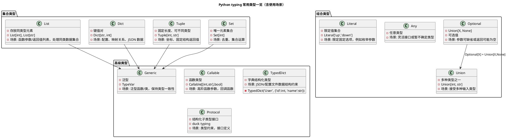

[toc]

# pathlib

官方文档: <https://docs.python.org/3/library/pathlib.html>

`pathlib` 是 Python 3.4 引入的标准库模块，用于 **面向对象地处理文件路径**。它是对 `os.path` 的现代替代方案，支持更清晰、跨平台、更强大的文件路径操作。

| 特点     | 说明                                              |
| -------- | ------------------------------------------------- |
| 面向对象 | 用路径对象表示路径，而不是字符串                  |
| 跨平台   | 自动处理不同操作系统的路径分隔符（如 `/` vs `\`） |
| 简洁     | 比 `os.path` 写法更直观                           |
| 强大     | 内建文件系统操作能力（读写、遍历、匹配等）        |

**常见应用场景与示例**

1. 导入和创建路径对象

   ```python
   from pathlib import Path

   # 当前目录
   p = Path('.')

   # 拼接路径（更推荐用 / 运算符）
   file_path = p / 'subdir' / 'file.txt'
   print(file_path)  # subdir/file.txt 或 subdir\file.txt（取决于系统）
   ```

2. **列出文件夹下的所有文件**

   ```python
   for f in Path('.').iterdir():
       print(f)
   ```

   过滤出文件：

   ```python
   files = [f for f in Path('.').iterdir() if f.is_file()]
   ```

3. **递归遍历目录树**

   ```python
   for path in Path('.').rglob('*.py'):
       print(path)
   ```

   > `rglob` 支持递归通配，比如找出所有 `.log` 文件等。

4. **路径拼接（代替 os.path.join）**

   ```python
   root = Path('/home/user')
   log_file = root / 'logs' / 'app.log'
   ```

5. **文件名/父目录提取**

   ```python
   p = Path('/home/user/data.csv')

   print(p.name)       # data.csv
   print(p.stem)       # data
   print(p.suffix)     # .csv
   print(p.parent)     # /home/user
   ```

6. **检测路径/文件存在与类型**

   ```python
   p = Path('test.txt')

   p.exists()      # 文件或目录是否存在
   p.is_file()     # 是不是文件
   p.is_dir()      # 是不是目录
   ```

7. **读取与写入文件（简洁！）**

   ```python
   # 写入
   Path('log.txt').write_text('hello world')

   # 读取
   text = Path('log.txt').read_text()
   ```

   > 也支持 `write_bytes()` 和 `read_bytes()`。

8. **创建文件夹 / 删除文件**

   ```python
   # 创建目录（如果不存在）
   Path('newdir').mkdir(exist_ok=True)

   # 删除文件
   Path('oldfile.txt').unlink()
   ```

9. **匹配文件名（非递归）**

   ```python
   for file in Path('.').glob('*.py'):
       print(file)
   ```

10. **获取绝对路径 / 规范化路径**

    ```python
    p = Path('some/../path/./file.txt')
    print(p.resolve())   # 返回规范化的绝对路径
    ```

11. **替换后缀**

    批量替换 `.txt` 为 `.log`

    ```python
    from pathlib import Path

    p = Path("example.txt")

    new_path = p.with_suffix(".log")
    print(new_path)  # 输出：example.log
    ```

    **注意事项**

    - `with_suffix()` **替换原有后缀**，包括点 `.`。若原路径没有后缀，`with_suffix()` 会直接添加新的后缀：

      ```python
      Path("file").with_suffix(".log")  # 得到 file.log
      ```

    - 保留原始文件名 + 添加额外后缀（非替换）

      如果你想保留 `.dump` 并变成 `.dump.log`，不能用 `with_suffix()`，应这样写：

      ```python
      new_name = file.with_name(file.name + ".log")
      ```

    - 若文件是**双重后缀**（如 `.tar.gz`），只替换最后一个：

      ```python
      Path("archive.tar.gz").with_suffix(".zip")  # archive.tar.zip
      ```

    - 如果你要真正**重命名文件**，加上 `.rename()` 即可：

      ```python
      p.rename(p.with_suffix(".log"))
      ```

**总结常用 API（备忘表）**

| 功能       | 方法                                                     |
| ---------- | -------------------------------------------------------- |
| 路径拼接   | `p / 'subdir' / 'file.txt'`                              |
| 获取名字   | `.name`, `.stem`, `.suffix`, `.parent`                   |
| 判断存在   | `.exists()`, `.is_file()`, `.is_dir()`                   |
| 遍历目录   | `.iterdir()`, `.glob()`, `.rglob()`                      |
| 文件操作   | `.read_text()`, `.write_text()`, `.unlink()`, `.mkdir()` |
| 规范化路径 | `.resolve()`                                             |

**推荐使用场景**

| 场景                             | pathlib 优势                     |
| -------------------------------- | -------------------------------- |
| 编写跨平台工具脚本               | 自动处理分隔符                   |
| 数据路径管理                     | 对路径字段统一处理               |
| 日志、缓存、输出路径构建         | 更清晰地拼接路径                 |
| 替代 os/os.path 写法             | 更可读、更现代化                 |
| 与 `open()`, `with` 搭配读写文件 | 可直接用路径对象，无需字符串转换 |

# typing 库

Python 的 `typing` 库是 **类型提示（Type Hints）** 的核心工具库，Python 3.5 以后引入，旨在给 Python 这种动态语言增加静态类型检查的能力，提高代码可读性和可靠性，同时可以配合 IDE 或类型检查工具（如 `mypy`、Pyright）发现潜在错误。

**一、基本概念**

Python 本身是动态类型语言，不要求声明变量类型：

```python
a = 10
a = "hello"  # Python 允许
```

使用 `typing` 可以写类型提示，让代码更易理解，也便于静态分析：

```python
from typing import List, Dict

def greet(names: List[str]) -> None:
    for name in names:
        print(f"Hello, {name}")
```

- `names: List[str]` 表示 `names` 是一个字符串列表
- `-> None` 表示函数没有返回值

> **注意：Python 解释器不会强制检查类型**，它只是提示和静态分析工具用的。

**二、常用类型**

1. **基本集合类型**

   ```python
   from typing import List, Tuple, Set, Dict

   names: List[str] = ["Alice", "Bob"]
   point: Tuple[int, int] = (10, 20)
   unique_ids: Set[int] = {1, 2, 3}
   mapping: Dict[str, int] = {"Alice": 1, "Bob": 2}
   ```

2. **可选类型**

   ```python
   from typing import Optional

   def get_name(id: int) -> Optional[str]:
       if id == 1:
           return "Alice"
       return None
   ```

   - `Optional[str]` 等价于 `Union[str, None]`，表示可能是 `str` 或 `None`。

3. **多类型联合**

   ```python
   from typing import Union

   def parse(value: Union[str, int]) -> str:
       return str(value)
   ```

   - `Union` 表示可能是多种类型之一

4. **可调用对象**

   ```python
   from typing import Callable

   def apply(func: Callable[[int, int], int], x: int, y: int) -> int:
       return func(x, y)
   ```

   - `Callable[[arg1_type, arg2_type], return_type]` 表示函数签名

5. **Any**

   ```python
   from typing import Any

   def process(value: Any):
       print(value)
   ```

   - 表示可以是任意类型

6. **Literal（Python 3.8+）**

   ```python
   from typing import Literal

   def move(direction: Literal["up", "down", "left", "right"]):
       print(f"Moving {direction}")
   ```

   - 限定某个参数只能是几个固定值

7. **Generic / TypeVar（泛型）**

   ```python
   from typing import TypeVar, List

   T = TypeVar("T")

   def first_element(lst: List[T]) -> T:
       return lst[0]
   ```

   - 用于编写泛型函数或类

**三、高级类型提示**

1. **TypedDict（Python 3.8+）**

   - 给字典定义“结构化”字段类型

   ```python
   from typing import TypedDict

   class User(TypedDict):
       id: int
       name: str
       active: bool

   user: User = {"id": 1, "name": "Alice", "active": True}
   ```

2. **Protocol / Structural Subtyping**

   - 类似接口/结构类型

   ```python
   from typing import Protocol

   class SupportsClose(Protocol):
       def close(self) -> None: ...

   def cleanup(resource: SupportsClose):
       resource.close()
   ```

3. **Annotated（Python 3.9+）**

   - 附加元信息，比如用于验证或框架提示：

   ```python
   from typing import Annotated

   Age = Annotated[int, "must be positive"]
   def set_age(age: Age):
       print(age)
   ```

**四、使用场景**

1. **提高可读性**
   - 团队开发中，函数参数和返回值类型一目了然
   - 类似于文档注释，但更规范
2. **静态类型检查**
   - 配合工具（`mypy`, `Pyright`）提前发现类型错误
   - 避免运行时才报错
3. **IDE 智能提示**
   - PyCharm、VSCode 可以提供自动补全和类型提示
   - 方便调用函数和访问对象属性
4. **数据结构约束**
   - 用 `TypedDict`, `Literal` 限制字典字段、枚举值
   - 用 `Generic` 写泛型数据结构
5. **大型项目和 API 设计**
   - 明确输入输出类型，方便多人协作
   - 配合 docstring，自动生成 API 文档

**五、`typing` 常用类型一览图**
把 `List/Dict/Tuple/Union/Optional/Any/Literal/TypedDict/Callable` 的关系和使用场景都可视化如下


