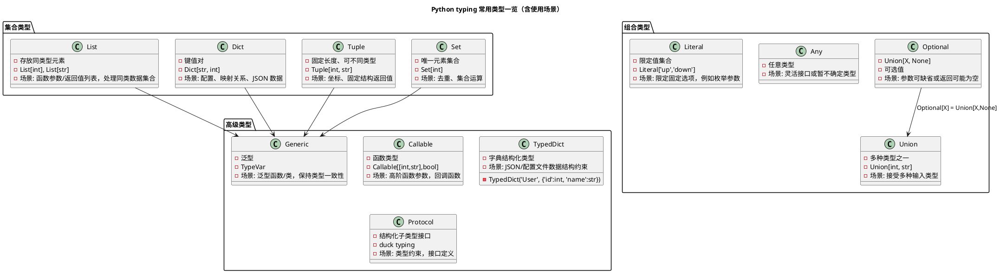
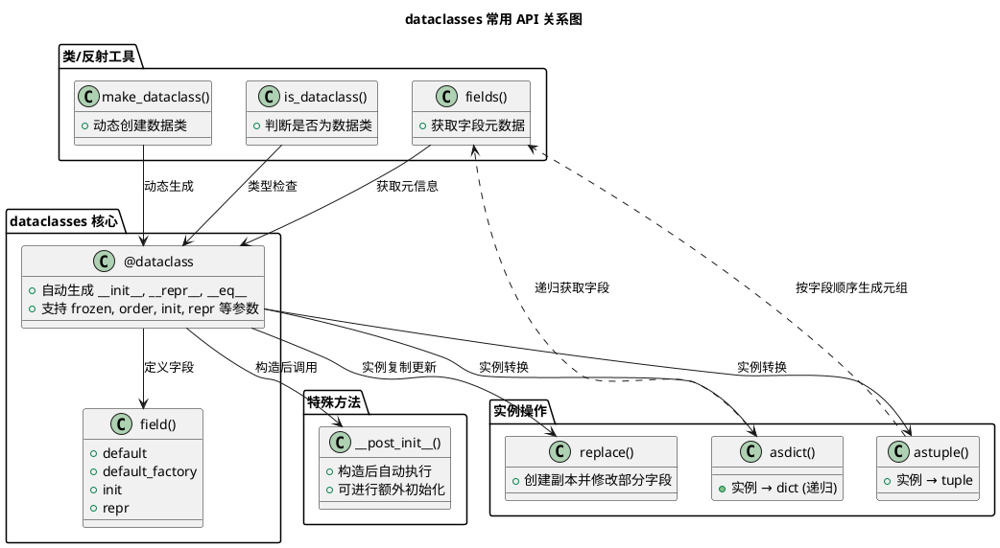

[toc]

# python 常用库\_4

## pathlib

官方文档: <https://docs.python.org/3/library/pathlib.html>

`pathlib` 是 Python 3.4 引入的标准库模块，用于 **面向对象地处理文件路径**。它是对 `os.path` 的现代替代方案，支持更清晰、跨平台、更强大的文件路径操作。

| 特点     | 说明                                              |
| -------- | ------------------------------------------------- |
| 面向对象 | 用路径对象表示路径，而不是字符串                  |
| 跨平台   | 自动处理不同操作系统的路径分隔符（如 `/` vs `\`） |
| 简洁     | 比 `os.path` 写法更直观                           |
| 强大     | 内建文件系统操作能力（读写、遍历、匹配等）        |

**常见应用场景与示例**

1. 导入和创建路径对象

   ```python
   from pathlib import Path

   # 当前目录
   p = Path('.')

   # 拼接路径（更推荐用 / 运算符）
   file_path = p / 'subdir' / 'file.txt'
   print(file_path)  # subdir/file.txt 或 subdir\file.txt（取决于系统）
   ```

2. **列出文件夹下的所有文件**

   ```python
   for f in Path('.').iterdir():
       print(f)
   ```

   过滤出文件：

   ```python
   files = [f for f in Path('.').iterdir() if f.is_file()]
   ```

3. **递归遍历目录树**

   ```python
   for path in Path('.').rglob('*.py'):
       print(path)
   ```

   > `rglob` 支持递归通配，比如找出所有 `.log` 文件等。

4. **路径拼接（代替 os.path.join）**

   ```python
   root = Path('/home/user')
   log_file = root / 'logs' / 'app.log'
   ```

5. **文件名/父目录提取**

   ```python
   p = Path('/home/user/data.csv')

   print(p.name)       # data.csv
   print(p.stem)       # data
   print(p.suffix)     # .csv
   print(p.parent)     # /home/user
   ```

6. **检测路径/文件存在与类型**

   ```python
   p = Path('test.txt')

   p.exists()      # 文件或目录是否存在
   p.is_file()     # 是不是文件
   p.is_dir()      # 是不是目录
   ```

7. **读取与写入文件（简洁！）**

   ```python
   # 写入
   Path('log.txt').write_text('hello world')

   # 读取
   text = Path('log.txt').read_text()
   ```

   > 也支持 `write_bytes()` 和 `read_bytes()`。

8. **创建文件夹 / 删除文件**

   ```python
   # 创建目录（如果不存在）
   Path('newdir').mkdir(exist_ok=True)

   # 删除文件
   Path('oldfile.txt').unlink()
   ```

9. **匹配文件名（非递归）**

   ```python
   for file in Path('.').glob('*.py'):
       print(file)
   ```

10. **获取绝对路径 / 规范化路径**

    ```python
    p = Path('some/../path/./file.txt')
    print(p.resolve())   # 返回规范化的绝对路径
    ```

11. **替换后缀**

    批量替换 `.txt` 为 `.log`

    ```python
    from pathlib import Path

    p = Path("example.txt")

    new_path = p.with_suffix(".log")
    print(new_path)  # 输出：example.log
    ```

    **注意事项**

    - `with_suffix()` **替换原有后缀**，包括点 `.`。若原路径没有后缀，`with_suffix()` 会直接添加新的后缀：

      ```python
      Path("file").with_suffix(".log")  # 得到 file.log
      ```

    - 保留原始文件名 + 添加额外后缀（非替换）

      如果你想保留 `.dump` 并变成 `.dump.log`，不能用 `with_suffix()`，应这样写：

      ```python
      new_name = file.with_name(file.name + ".log")
      ```

    - 若文件是**双重后缀**（如 `.tar.gz`），只替换最后一个：

      ```python
      Path("archive.tar.gz").with_suffix(".zip")  # archive.tar.zip
      ```

    - 如果你要真正**重命名文件**，加上 `.rename()` 即可：

      ```python
      p.rename(p.with_suffix(".log"))
      ```

**总结常用 API（备忘表）**

| 功能       | 方法                                                     |
| ---------- | -------------------------------------------------------- |
| 路径拼接   | `p / 'subdir' / 'file.txt'`                              |
| 获取名字   | `.name`, `.stem`, `.suffix`, `.parent`                   |
| 判断存在   | `.exists()`, `.is_file()`, `.is_dir()`                   |
| 遍历目录   | `.iterdir()`, `.glob()`, `.rglob()`                      |
| 文件操作   | `.read_text()`, `.write_text()`, `.unlink()`, `.mkdir()` |
| 规范化路径 | `.resolve()`                                             |

**推荐使用场景**

| 场景                             | pathlib 优势                     |
| -------------------------------- | -------------------------------- |
| 编写跨平台工具脚本               | 自动处理分隔符                   |
| 数据路径管理                     | 对路径字段统一处理               |
| 日志、缓存、输出路径构建         | 更清晰地拼接路径                 |
| 替代 os/os.path 写法             | 更可读、更现代化                 |
| 与 `open()`, `with` 搭配读写文件 | 可直接用路径对象，无需字符串转换 |

## typing 库

Python 的 `typing` 库是 **类型提示（Type Hints）** 的核心工具库，Python 3.5 以后引入，旨在给 Python 这种动态语言增加静态类型检查的能力，提高代码可读性和可靠性，同时可以配合 IDE 或类型检查工具（如 `mypy`、Pyright）发现潜在错误。

**一、基本概念**

Python 本身是动态类型语言，不要求声明变量类型：

```python
a = 10
a = "hello"  # Python 允许
```

使用 `typing` 可以写类型提示，让代码更易理解，也便于静态分析：

```python
from typing import List, Dict

def greet(names: List[str]) -> None:
    for name in names:
        print(f"Hello, {name}")
```

- `names: List[str]` 表示 `names` 是一个字符串列表
- `-> None` 表示函数没有返回值

> **注意：Python 解释器不会强制检查类型**，它只是提示和静态分析工具用的。

**二、常用类型**

1. **基本集合类型**

   ```python
   from typing import List, Tuple, Set, Dict

   names: List[str] = ["Alice", "Bob"]
   point: Tuple[int, int] = (10, 20)
   unique_ids: Set[int] = {1, 2, 3}
   mapping: Dict[str, int] = {"Alice": 1, "Bob": 2}
   ```

2. **可选类型**

   ```python
   from typing import Optional

   def get_name(id: int) -> Optional[str]:
       if id == 1:
           return "Alice"
       return None
   ```

   - `Optional[str]` 等价于 `Union[str, None]`，表示可能是 `str` 或 `None`。

3. **多类型联合**

   ```python
   from typing import Union

   def parse(value: Union[str, int]) -> str:
       return str(value)
   ```

   - `Union` 表示可能是多种类型之一

4. **可调用对象**

   ```python
   from typing import Callable

   def apply(func: Callable[[int, int], int], x: int, y: int) -> int:
       return func(x, y)
   ```

   - `Callable[[arg1_type, arg2_type], return_type]` 表示函数签名

5. **Any**

   ```python
   from typing import Any

   def process(value: Any):
       print(value)
   ```

   - 表示可以是任意类型

6. **Literal（Python 3.8+）**

   ```python
   from typing import Literal

   def move(direction: Literal["up", "down", "left", "right"]):
       print(f"Moving {direction}")
   ```

   - 限定某个参数只能是几个固定值

7. **Generic / TypeVar（泛型）**

   ```python
   from typing import TypeVar, List

   T = TypeVar("T")

   def first_element(lst: List[T]) -> T:
       return lst[0]
   ```

   - 用于编写泛型函数或类

**三、高级类型提示**

1. **TypedDict（Python 3.8+）**

   - 给字典定义“结构化”字段类型

   ```python
   from typing import TypedDict

   class User(TypedDict):
       id: int
       name: str
       active: bool

   user: User = {"id": 1, "name": "Alice", "active": True}
   ```

2. **Protocol / Structural Subtyping**

   - 类似接口/结构类型

   ```python
   from typing import Protocol

   class SupportsClose(Protocol):
       def close(self) -> None: ...

   def cleanup(resource: SupportsClose):
       resource.close()
   ```

3. **Annotated（Python 3.9+）**

   - 附加元信息，比如用于验证或框架提示：

   ```python
   from typing import Annotated

   Age = Annotated[int, "must be positive"]
   def set_age(age: Age):
       print(age)
   ```

**四、使用场景**

1. **提高可读性**
   - 团队开发中，函数参数和返回值类型一目了然
   - 类似于文档注释，但更规范
2. **静态类型检查**
   - 配合工具（`mypy`, `Pyright`）提前发现类型错误
   - 避免运行时才报错
3. **IDE 智能提示**
   - PyCharm、VSCode 可以提供自动补全和类型提示
   - 方便调用函数和访问对象属性
4. **数据结构约束**
   - 用 `TypedDict`, `Literal` 限制字典字段、枚举值
   - 用 `Generic` 写泛型数据结构
5. **大型项目和 API 设计**
   - 明确输入输出类型，方便多人协作
   - 配合 docstring，自动生成 API 文档

**五、`typing` 常用类型一览图**
把 `List/Dict/Tuple/Union/Optional/Any/Literal/TypedDict/Callable` 的关系和使用场景都可视化如下



## dataclasses

**一、`dataclasses` 简介**

`dataclasses` 是 Python 3.7 引入的一个标准库模块（3.6 可以用 backport 包 `dataclasses` 安装），
它的主要目的是简化“**数据容器类**”的定义，减少样板代码（boilerplate），尤其是 `__init__`、`__repr__`、`__eq__` 等方法的重复编写。

传统写法：

```python
class Point:
    def __init__(self, x: int, y: int):
        self.x = x
        self.y = y

    def __repr__(self):
        return f"Point(x={self.x}, y={self.y})"
```

使用 `@dataclass`：

```python
from dataclasses import dataclass

@dataclass
class Point:
    x: int
    y: int
```

**自动生成** `__init__`、`__repr__`、`__eq__` 等方法，减少手写代码。

**二、核心功能**

| 功能               | 描述                                                                    |
| ------------------ | ----------------------------------------------------------------------- |
| **自动生成方法**   | `__init__`、`__repr__`、`__eq__`、`__hash__`、`__lt__` 等               |
| **类型标注支持**   | 用类型注解定义字段（推荐，但不是强制）                                  |
| **可配置字段行为** | 通过 `field()` 控制字段的默认值、是否参与比较、是否出现在 `__repr__` 等 |
| **不可变对象**     | 通过 `frozen=True` 创建不可变数据类                                     |
| **排序支持**       | 通过 `order=True` 生成比较运算符                                        |
| **辅助函数**       | `asdict()`、`astuple()`、`replace()`、`fields()` 等                     |

**三、装饰器 `@dataclass` 常用参数**

```python
@dataclass(init=True, repr=True, eq=True, order=False, frozen=False)
class MyClass:
    ...
```

| 参数            | 默认值  | 含义                                                  |
| --------------- | ------- | ----------------------------------------------------- |
| `init`          | `True`  | 自动生成 `__init__` 方法                              |
| `repr`          | `True`  | 自动生成 `__repr__` 方法(可读的字符串，主要用于调试)  |
| `eq`            | `True`  | 自动生成 `__eq__` 方法                                |
| `order`         | `False` | 自动生成排序比较方法（需要 `eq=True`）                |
| `frozen`        | `False` | 生成不可变对象（字段赋值会报错）                      |
| `unsafe_hash`   | `False` | 自动生成 `__hash__`，即使 `eq=True` 且 `frozen=False` |
| `slots` (3.10+) | `False` | 使用 `__slots__` 节省内存                             |

注意事项：

- `@dataclass` 里的字段必须有类型注解（除非你用 `field()` 明确声明）。
- 如果字段有**可变默认值**（`list`, `dict` 等），一定要用 `field(default_factory=...)`，否则会出现共享引用的坑。

**四、`field()` 的作用**

`field()` 用于为单个字段设置细粒度控制。

常用参数：

```python
from dataclasses import field

@dataclass
class Person:
    name: str
    age: int = 18
    id: int = field(default_factory=lambda: random.randint(1000, 9999))
    temp_data: list = field(default_factory=list, repr=False, compare=False)  # 每个对象独立的列表
```

| 参数              | 作用                               |
| ----------------- | ---------------------------------- |
| `default`         | 字段默认值                         |
| `default_factory` | 默认值工厂（避免可变默认值陷阱）   |
| `init`            | 是否出现在 `__init__` 参数中       |
| `repr`            | 是否出现在 `__repr__` 输出中       |
| `compare`         | 是否参与比较运算（`__eq__`、排序） |
| `metadata`        | 存放自定义元数据字典               |

注意事项：

- 如果字段是可变类型（`list`, `dict`, `set`），**不要用 `default=[]`**，要用 `default_factory=list`，否则多个实例会共享一个列表。

**五、常用辅助函数**

```python
from dataclasses import asdict, astuple, replace, fields, is_dataclass

p = Person(name="Alice")

asdict(p)       # {'name': 'Alice', 'age': 18, 'id': 1234, 'temp_data': []}
astuple(p)      # ('Alice', 18, 1234, [])
replace(p, age=20)  # 创建一个新对象，修改部分字段
fields(p)       # 获取字段元信息
is_dataclass(p) # True
```

| 函数                                | 用途                               |
| ----------------------------------- | ---------------------------------- |
| `asdict(obj)`                       | 递归转 `dict`                      |
| `astuple(obj)`                      | 转 `tuple`                         |
| `replace(obj, **kwargs)`            | 创建修改版对象                     |
| `fields(obj)`                       | 获取字段元信息（`Field` 对象列表） |
| `is_dataclass(obj)`                 | 检查是否为数据类                   |
| `make_dataclass(name, fields, ...)` | 动态创建数据类                     |

**六、`__post_init__()` 生命周期钩子**

`__post_init__()` 会在自动生成的 `__init__` 执行后调用，可用于**二次初始化**或验证字段。

```python
@dataclass
class User:
    name: str
    age: int

    def __post_init__(self):
        if self.age < 0:
            raise ValueError("年龄不能为负数")
```

**七、典型应用场景**

- 配置对象（如解析 YAML/JSON 配置后映射成类）
- 简单数据结构（点、向量、树节点）
- 数据传输对象（DTO）
- 单元测试数据模型
- 与 `from_dict()` / `to_dict()` 配合，进行序列化和反序列化

**八、总结**

| 方法 / 装饰器      | 作用                                                                     | 常见参数                                                                                                                                 | 使用示例                                                           | 使用场景                                 |
| ------------------ | ------------------------------------------------------------------------ | ---------------------------------------------------------------------------------------------------------------------------------------- | ------------------------------------------------------------------ | ---------------------------------------- |
| `@dataclass`       | 将一个普通类转为数据类，自动生成 `__init__`、`__repr__`、`__eq__` 等方法 | `init=True` / `False`（是否生成 `__init__`） `repr=True`（是否生成 `__repr__`） `frozen=True`（不可变对象） `order=True`（生成比较方法） | `@dataclass(frozen=True, order=True) class Point: x: int; y: int ` | 定义只存储数据、不需要手写方法的类       |
| `field()`          | 为某个字段自定义默认值、默认工厂、是否出现在 `__init__` 等               | `default=...`（默认值） `default_factory=...`（工厂函数） `init=False`（不在构造函数出现） `repr=False`（不显示在 `repr`）               | `scores: list = field(default_factory=list) `                      | 列表、字典等可变类型默认值；控制字段行为 |
| `asdict()`         | 将数据类实例转为 `dict`（递归转换）                                      | /                                                                                                                                        | `asdict(obj) `                                                     | 序列化到 JSON、日志输出                  |
| `astuple()`        | 将数据类实例转为元组                                                     | /                                                                                                                                        | `astuple(obj) `                                                    | 快速打包成元组，便于比较                 |
| `replace()`        | 创建对象副本，并修改部分字段                                             | /                                                                                                                                        | `new_obj = replace(obj, x=10) `                                    | 不可变对象的更新                         |
| `fields()`         | 获取数据类字段的元数据                                                   | /                                                                                                                                        | `for f in fields(Point): print(f.name, f.type) `                   | 反射、动态生成表单                       |
| `is_dataclass()`   | 判断对象或类是否为数据类                                                 | /                                                                                                                                        | `is_dataclass(Point) `                                             | 类型检查                                 |
| `make_dataclass()` | 动态创建数据类                                                           | /                                                                                                                                        | `Point = make_dataclass("Point", [("x", int), ("y", int)]) `       | 动态生成类结构                           |
| `__post_init__()`  | 构造完成后自动调用，用于额外初始化                                       | /                                                                                                                                        | `def __post_init__(self): self.z = self.x + self.y `               | 复杂初始化逻辑                           |

使用建议

- **可变类型**（list/dict/set）要用 `field(default_factory=...)`，避免共享引用。
- 需要 JSON 序列化时，可以配合 `asdict()`。
- 如果需要不可变数据类（比如键值缓存），使用 `@dataclass(frozen=True)`。
- `replace()` 非常适合更新不可变对象。
- `__post_init__()` 在需要额外验证或计算派生字段时很好用。



## pprint 库

`pprint` 是 Python 标准库里的 **Pretty Print** 工具，专门用于 **美观、易读地打印复杂数据结构**。它在调试和日志记录时尤其常用。

**一、`pprint` 基础用法**

```python
import pprint

data = {
    "user": "alice",
    "roles": ["admin", "editor", "viewer"],
    "config": {
        "theme": "dark",
        "notifications": {"email": True, "sms": False}
    }
}

pprint.pprint(data)
```

输出效果比普通 `print(data)` 更清晰：

```python
{'config': {'notifications': {'email': True, 'sms': False}, 'theme': 'dark'},
 'roles': ['admin', 'editor', 'viewer'],
 'user': 'alice'}
```

相比 `print()`，`pprint` 会：

- 自动缩进和换行
- 控制行宽（避免一行太长）
- 保持键排序一致（默认按字典 key 排序）
- 让嵌套结构更容易读

**二、常用 API**

1. **`pprint.pprint(object, stream=None, indent=1, width=80, depth=None, compact=False, sort_dicts=True)`**

   - `object`：要打印的对象
   - `stream`：输出目标（默认是 `sys.stdout`）
   - `indent`：缩进级别（默认 1）
   - `width`：行宽（默认 80 字符，超过会换行）
   - `depth`：限制打印深度，超过层级会用 `...` 代替
   - `compact`：是否尽量紧凑打印列表/元组
   - `sort_dicts`：是否对字典 key 排序（Python 3.8+ 默认 True）

   ```python
   pprint.pprint(data, indent=4, width=60, depth=2, compact=True)
   ```

2. **`pprint.pformat(object, ...)`**

   - 和 `pprint()` 类似，但返回的是 **字符串**，而不是直接打印。
   - 适合写入日志或文件。

   ```python
   s = pprint.pformat(data, indent=2)
   print("Formatted data:\n", s)
   ```

3. **`pprint.isreadable(object)`**

   - 判断对象是否能被 `eval(repr(obj))` 正确还原。

4. **`pprint.isrecursive(object)`**

   - 判断对象是否包含自引用（比如一个 list 包含自己）。

**三、典型使用场景**

1. **调试复杂数据结构**

   - 打印嵌套的字典、列表、JSON 数据时，让输出更清晰。

   ```python
   import json
   data = json.loads('{"a":1,"b":{"x":[1,2,3],"y":true}}')
   pprint.pprint(data)
   ```

2. **日志记录**

   - 在日志中输出结构化数据时，用 `pprint.pformat` 生成更可读的字符串。

   ```python
   import logging
   logging.basicConfig(level=logging.INFO)
   logging.info("Args: %s", pprint.pformat(vars(args)))
   ```

3. **配置文件或参数展示**

   - 在程序启动时，把命令行参数或配置项以漂亮的方式打印出来，便于检查。

   ```python
   args_dict = vars(args)
   print("Current configuration:")
   pprint.pprint(args_dict)
   ```

4. **交互式调试（REPL、Jupyter Notebook）**

   - 直接 `pprint` 大数据结构，避免一行滚屏。

5. **输出可控层级**

   - 数据很深时，可以限制 `depth` 只看一部分，避免信息爆炸。

   ```python
   pprint.pprint(data, depth=1)
   ```

**四、和 `json.dumps(..., indent=4)` 的区别**

- `pprint` 更通用（适用于任意 Python 对象，比如类实例、集合等）。
- `json.dumps` 只能处理 JSON 兼容对象（字典、列表、字符串、数值、布尔、None）。
- `pprint` 打印的是 **合法 Python 表达式**，而不是 JSON。

**总结**：
`pprint` 的典型使用场景是 **调试、日志记录、参数打印、复杂数据可视化**。核心 API 是 `pprint()`（直接打印）和 `pformat()`（返回字符串）。
